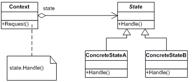

## State Design Pattern

This design pattern allows the objects to change its behaviour based on its internal state.
The object will appear to change its 'class'


## UML Class diagram




### Participants

1. **Context**: 
* This class maintains an instance of concreteState subclass which defines the current state.

2. **State**: 
* Defines an interface for encapsulating the behaviour associated with a particular state.

3. **Concrete State**:
* Each subclass implements the defined interface which defines the behaviour in that state.

### Running the project

* Use the dotnet cli to build the project
```
dotnet build
```

* Since this is a class library this is not a runnable file, so test it with 
```
dotnet test
```
